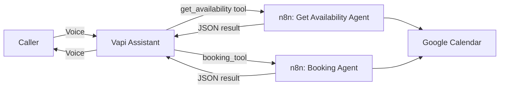

# Voice-Agent-With-Vapi

A voice AI receptionist that checks calendar availability and books appointments over a live phone/voice call — built with **Vapi** as the voice front end and **n8n** as the automation backend, backed by **Google Calendar**.

Say "book me for tomorrow at 3pm" out loud, and the agent checks your real calendar, books a real event, and confirms — all through natural conversation.

---

## Sample conversation

```
Caller:    Hi, can you check if tomorrow at 3 PM is available?
Assistant: Of course. May I have your name and phone number first?
Caller:    Sure, it's Alex, 9876543210.
Assistant: Thanks, Alex. Checking availability... Tomorrow at 3 PM
           is available. Would you like me to book it?
Caller:    Yes, please.
Assistant: Perfect — your appointment is confirmed for tomorrow,
           3:00 PM to 4:00 PM, under Alex. See you then!
```

Every line here reflects an actual tested call — the assistant genuinely queries Google Calendar and creates a real event, it isn't scripted output.

---

## How it works



1. **Vapi** hosts the voice assistant — it handles speech-to-text, the conversation logic, and text-to-speech.
2. When the caller asks about availability or wants to book, Vapi calls one of two **custom tools**, each pointing at an **n8n webhook**.
3. Each n8n workflow runs an **AI Agent** (Google Gemini) with a **Google Calendar** tool attached, does the actual calendar work, and replies in the exact JSON shape Vapi expects.
4. Vapi speaks the result back to the caller.

---

## Features

- **Natural voice booking** — caller can check availability and book an appointment in one conversation, no forms
- **Real calendar integration** — every check and booking touches an actual Google Calendar, not mock data
- **Create-or-update logic** — a returning caller (matched by phone number) has their *existing* appointment updated instead of a duplicate being created
- **Structured tool responses** — both n8n workflows return Vapi's required `{ results: [{ toolCallId, result }] }` format

---

## Tech stack

| Layer | Tool |
|---|---|
| Voice assistant / orchestration | [Vapi](https://vapi.ai) |
| Backend automation | [n8n](https://n8n.io) (Cloud) |
| AI model (per workflow) | Google Gemini |
| Calendar | Google Calendar API |
| Transcription | Soniox (via Vapi) |

---

## Tools

### `get_availability`
Checks Google Calendar for a given date/time and reports whether it's free.

**Parameters:** `date` (string)

### `booking_tool`
Books a new appointment, or **updates an existing one** if the same phone number already has a booking.

**Parameters:** `date`, `name`, `phone`

The phone number is stored in the calendar event's description and used as the lookup key — see [Bug found & fixed](#bug-found--fixed) below for why this exists.

---

## Setup

1. **n8n**: Import/build the two workflows (`Get Availability Agent`, `Booking Agent`), each starting with a Webhook (POST) node and ending with a Respond to Webhook node. Connect a Google Calendar credential.
2. **Vapi**: Create an assistant, add the `get_availability` and `booking_tool` custom tools, and set each tool's Server URL to the matching n8n webhook's production URL.
3. **System prompt**: Configure the assistant to always collect the caller's name and phone number, and to pass the phone number on every booking/update request.
4. **Publish** both n8n workflows — a draft workflow's webhook will not respond to real calls.
5. Test via Vapi's built-in "Talk" feature before trusting a live phone number.

---

## Bug found & fixed

**The problem:** early on, when a caller asked to change a detail on an appointment they'd just booked (e.g. "actually, my name is X, not Y"), the assistant *said* it had updated the booking — but the booking tool only knew how to *create* events. The result was two separate calendar events for the same slot, one for each name.

**The fix:** the caller's phone number is now stored in each event's description at creation time. Before booking, the workflow searches the calendar for an existing event tied to that phone number:
- **Match found** → the existing event is updated (new time/name), not duplicated
- **No match** → a new event is created

This was verified with a live test: the same phone number was used to create a booking, then immediately submit a second request with a different name and time. The calendar confirmed exactly one event existed afterward, updated in place (`sequence: 1`), not two.

**Takeaway:** an LLM-driven voice agent can sound completely confident about an action it never actually performed, if the underlying tool doesn't support it. Always verify against the real system (in this case, the actual calendar), not the assistant's spoken confirmation.

---

## Known limitations / not built (yet)

This is a learning and showcase project, not a production deployment. The following are intentionally out of scope for now:

- No cancellation tool (only create/update)
- No authentication on the webhook endpoints
- No retry/fallback handling if a tool call fails mid-conversation
- No SMS/email confirmation after booking
- Matching is by phone number only — no handling for a caller who calls from a different number

## Possible future improvements

- Add a cancellation tool
- Secure the n8n webhooks (e.g. header auth)
- Send a confirmation SMS or email after booking
- Handle the caller asking for a slot that's already booked with alternative suggestions

---

## Status

Core functionality (availability check, booking, and create-or-update logic) is built and **live-verified** against real Google Calendar and real voice calls. Not intended for production use as-is.